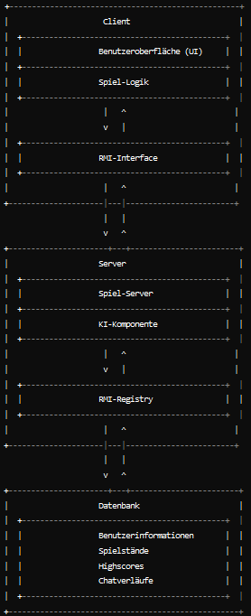

## Systemübersicht (Author:in)

Die Systemarchitektur des digitalen "Mensch ärgere dich nicht"-Spiels besteht aus einer Server-Client-Struktur, die durch Java RMI (Remote Method Invocation) kommuniziert. Diese Architektur ermöglicht es, sowohl Einzelspieler- als auch Mehrspielermodi zu unterstützen und die erforderliche Flexibilität und Skalierbarkeit zu gewährleisten.

Die Client-Komponente umfasst die Benutzeroberfläche (UI) und die Spiel-Logik. Die UI wird mit JavaFX entwickelt und stellt das klassische "Mensch ärgere dich nicht"-Spielbrett sowie alle Interaktionsmöglichkeiten dar. Hier können die Spieler das Spiel starten, ihre Züge machen, mit anderen Spielern chatten und ihren Punktestand einsehen. Die Spiel-Logik auf der Client-Seite ermöglicht es, lokale Spielzüge zu validieren, bevor sie an den Server gesendet werden. Sie kommuniziert direkt mit der Server-Komponente, um die Spielzustände zu synchronisieren.

Die Server-Komponente besteht aus dem Spiel-Server und der RMI-Registry. Der Spiel-Server verwaltet die Spielzustände, die Spiel-Logik für Multiplayer-Spiele und die Kommunikation zwischen verschiedenen Clients. Er stellt sicher, dass alle Spielzüge korrekt und gemäß den Spielregeln ausgeführt werden. Die RMI-Registry ermöglicht die Kommunikation zwischen dem Client und dem Server, indem entfernte Objekte registriert werden, die von den Clients aufgerufen werden können.

Eine wichtige Komponente der Systemarchitektur ist die Datenbank, die Spielstände und Benutzerinformationen speichert. Diese Datenbank enthält alle notwendigen Informationen wie Benutzerkonten, Spielstände, Highscores und Chatverläufe, was es ermöglicht, Spiele fortzusetzen und Statistiken zu führen. Die Kommunikation zwischen dem Server und der Datenbank erfolgt bidirektional, sodass Daten sowohl gespeichert als auch abgerufen werden können.

Eine weitere wesentliche Komponente ist die KI-Komponente, die KI-Gegner simuliert und deren Züge berechnet. Diese Komponente ist in die Spiel-Logik integriert und ermöglicht es den Spielern, gegen den Computer zu spielen.

Die Java RMI-Schnittstelle ermöglicht die Kommunikation zwischen der Client- und der Server-Komponente. Diese Schnittstelle erlaubt es dem Client, entfernte Methoden auf dem Server aufzurufen, um Spielzüge zu übermitteln, Spielzustände zu aktualisieren und Chatnachrichten zu senden. Die RMI-Schnittstelle registriert entfernte Objekte in der RMI-Registry, die von den Clients abgerufen und verwendet werden können. Diese Kommunikation erfolgt über das Netzwerk und erfordert die Serialisierung der Objekte.

Die Datenbank-Schnittstelle ermöglicht den Zugriff auf gespeicherte Daten wie Benutzerinformationen, Spielstände und Chatverläufe sowie das Speichern dieser Daten. Diese Schnittstelle verwendet JDBC (Java Database Connectivity) für den Zugriff auf eine relationale Datenbank. CRUD-Operationen (Create, Read, Update, Delete) werden zur Verwaltung der Daten verwendet.

Zusammenfassend bietet diese Architektur einen robusten Rahmen für die Entwicklung des digitalen "Mensch ärgere dich nicht"-Spiels, der eine nahtlose Kommunikation zwischen den verschiedenen Komponenten und eine effiziente Verwaltung der Spiel- und Benutzerdaten gewährleistet.
