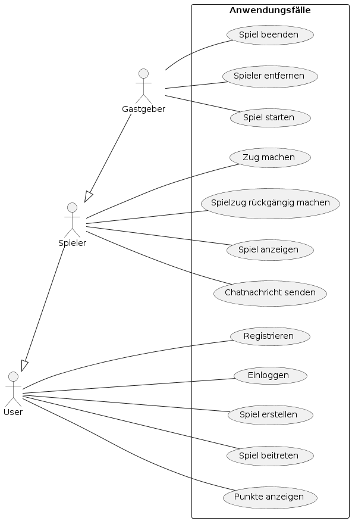

## Anwendungsfälle 

Beschreibungen der Anwendungsfälle

    User
        Registrieren: Ein neuer Benutzer erstellt ein Konto, indem er einen Namen, eine E-Mail und ein Passwort eingibt.
        Einloggen: Ein registrierter Benutzer meldet sich mit seiner E-Mail und seinem Passwort an.
        Spiel erstellen: Ein Benutzer erstellt ein neues Spiel und wird zum Gastgeber des Spiels.
        Spiel beitreten: Ein Benutzer tritt einem bestehenden Spiel bei.
        Punkte anzeigen: Ein Benutzer kann seinen aktuellen Punktestand anzeigen lassen.

    Spieler
        Zug machen: Ein Spieler macht seinen Zug gemäß den Regeln des Spiels. Dieser umfasst das Würfeln, das Auswählen und Bewegen der Spielfigur, das Schlagen gegnerischer Figuren und das Beenden des Zuges.
        Spielzug rückgängig machen: Ein Spieler kann unter bestimmten Bedingungen seinen letzten Zug rückgängig machen.
        Spiel anzeigen: Ein Spieler kann das aktuelle Spielbrett und den Spielstatus anzeigen.
        Chatnachricht senden: Ein Spieler sendet eine Nachricht über den Chat während des Spiels.

    Gastgeber (erbt von Spieler)
        Spiel starten: Der Gastgeber startet das Spiel, wenn alle Spieler bereit sind.
        Spieler entfernen: Der Gastgeber kann Spieler aus dem Spiel entfernen, falls nötig.
        Spiel beenden: Der Gastgeber kann das Spiel beenden.

Liste der Anwendungsfälle:  

- [AF Nutzer registrieren](06_01_AF_NutzerRegistrieren.md)
- [AF Nutzer anmelden](06_02_AF_NutzerAnmelden.md)
- ...
