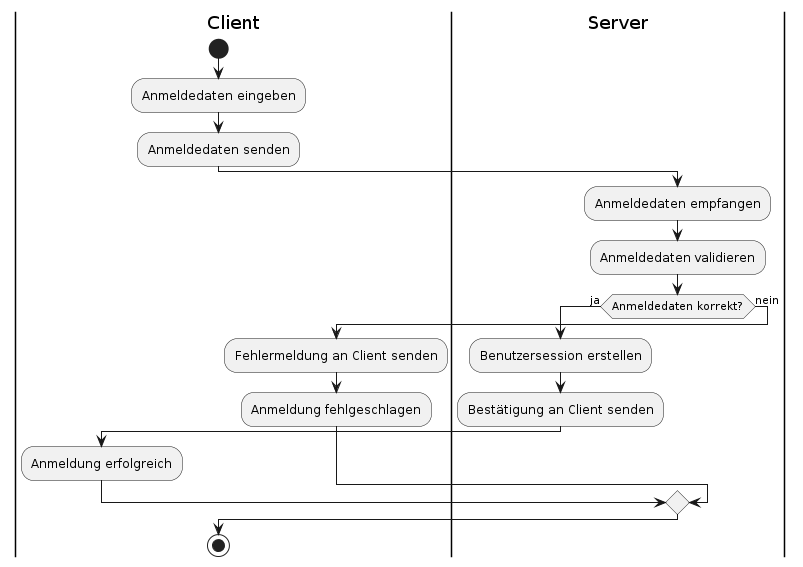

### AF 4oAnmelden (Author:in)

Der Anwendungsfall „Anmelden“ ermöglicht es einem registrierten Benutzer, sich mit seiner E-Mail-Adresse und seinem Passwort am System anzumelden, um Zugang zu den Funktionen der Anwendung zu erhalten.

**Akteur:** User

**Auslöser:** Der User möchte sich in das System einloggen, um auf seine Spiele und Kontodaten zuzugreifen.

**Vorbedingung:** Der Benutzer muss bereits ein registriertes Konto besitzen.

**Häufigkeit:** Dieser Anwendungsfall tritt häufig auf, da jeder Benutzer sich anmelden muss, um die Anwendung nutzen zu können.

**Startseite anzeigen:** Die Startseite der Anwendung wird dem Benutzer angezeigt, auf der er die Möglichkeit hat, sich anzumelden.

**Anmeldedaten eingeben:** Der Benutzer gibt seine E-Mail-Adresse und sein Passwort in die entsprechenden Felder ein.

**Anmeldedaten (E-Mail, Passwort) absenden:** Der Benutzer klickt auf die Schaltfläche zum Anmelden, und die eingegebenen Anmeldedaten werden an den Server gesendet.

**Fehlermeldung anzeigen:** Wenn die Anmeldung fehlschlägt (z.B. wegen falscher E-Mail oder falschem Passwort), wird eine Fehlermeldung auf der Startseite angezeigt.

**Benutzer als angemeldet markieren:** Bei erfolgreicher Anmeldung wird der Benutzer als angemeldet markiert und kann auf die Funktionen der Anwendung zugreifen.

**Anmeldedaten empfangen:** Der Server empfängt die vom Client gesendeten Anmeldedaten.

**Benutzer in der Datenbank suchen:** Der Server sucht in der Datenbank nach einem Benutzer mit der angegebenen E-Mail-Adresse.

**Passwort überprüfen:** Der Server vergleicht das gesendete Passwort mit dem in der Datenbank gespeicherten Passwort des Benutzers.

**Fehlermeldung zurücksenden:** Wenn die E-Mail-Adresse oder das Passwort falsch ist, sendet der Server eine Fehlermeldung zurück an den Client.

**Session erstellen:** Bei erfolgreicher Anmeldung wird eine neue Session für den Benutzer erstellt, um die Authentifizierung während der Sitzung aufrechtzuerhalten.

**Bestätigung zurücksenden:** Der Server sendet eine Bestätigung der erfolgreichen Anmeldung an den Client.