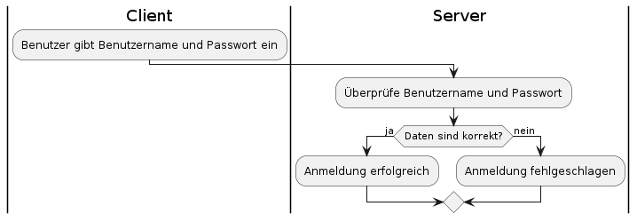

### AF Anmelden (Author:in)

Der Anwendungsfall "Anmelden" ermöglicht es einem registrierten Benutzer, sich mit seinen Zugangsdaten beim System anzumelden.

**Akteur:** Benutzer

**Auslöser:** Der Benutzer möchte auf die Anwendung zugreifen und klickt auf den Anmelde-Button.

**Vorbedingung:** Der Benutzer hat ein gültiges Benutzerkonto und kennt seine Zugangsdaten (E-Mail-Adresse und Passwort).

**Häufigkeit:** Jedes Mal, wenn der Benutzer die Anwendung nutzen möchte.

**Anmeldeformular ausfüllen** Der Benutzer gibt seine E-Mail-Adresse und sein Passwort in das Anmeldeformular ein.

**Anmeldedaten überprüfen** Der Server überprüft, ob die eingegebenen Anmeldedaten mit den gespeicherten Benutzerdaten übereinstimmen.

**Anmeldung erfolgreich** Wenn die Anmeldedaten korrekt sind, wird der Benutzer angemeldet und erhält Zugriff auf die Anwendung.

**Anmeldung fehlgeschlagen** Wenn die Anmeldedaten nicht korrekt sind, wird eine Fehlermeldung angezeigt und der Benutzer wird aufgefordert, seine Anmeldedaten erneut einzugeben.