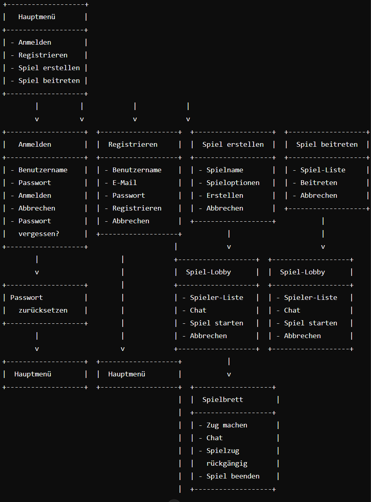

## Benutzungsschnittstelle

Hauptmenü:

    Startpunkt der Anwendung.
    Navigation zu den Dialogen „Anmelden“, „Registrieren“, „Spiel erstellen“ und „Spiel beitreten“.

Anmelden:

    Eingabe des Benutzernamens und Passworts zur Anmeldung.
    Navigation zum Passwort-zurücksetzen-Dialog.
    Navigation zurück zum Hauptmenü.

Registrieren:

    Eingabe der Registrierungsdaten (Benutzername, E-Mail, Passwort).
    Navigation zurück zum Hauptmenü.

Spiel erstellen:

    Eingabe der Spieldaten (Spielname, Spieloptionen).
    Navigation zur Spiel-Lobby.
    Navigation zurück zum Hauptmenü.

Spiel-Lobby:

    Anzeige der Spieler-Liste und Chat.
    Möglichkeit, das Spiel zu starten oder abzubrechen.
    Navigation zum Spielbrett.
    Navigation zurück zum Hauptmenü (bei Abbrechen).

Spiel beitreten:

    Auswahl eines vorhandenen Spiels aus der Spiel-Liste.
    Navigation zur Spiel-Lobby.
    Navigation zurück zum Hauptmenü.

Spielbrett:

    Anzeige des Spielbretts und der Spieloptionen.
    Möglichkeit, einen Zug zu machen, den Zug rückgängig zu machen oder das Spiel zu beenden.
    Nutzung der Chat-Funktion während des Spiels.

Passwort zurücksetzen:

    Eingabe der E-Mail-Adresse zum Zurücksetzen des Passworts.
    Navigation zurück zum Hauptmenü.
