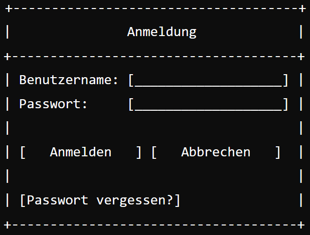

### Dialog Anmelden (Author:in)

Der Anmeldedialog wird geöffnet, wenn ein Benutzer die Option „Anmelden“ im Hauptmenü der Anwendung auswählt oder wenn der Benutzer versucht, auf geschützte Bereiche der Anwendung zuzugreifen, für die eine Authentifizierung erforderlich ist. Der Dialog wird auch angezeigt, wenn der Benutzer nach der Registrierung auf „Anmelden“ klickt.
**Skizze:**

**Benutzername:** 
    Beschreibung: Textfeld zur Eingabe des Benutzernamens.
    Eingabe: Der Benutzer gibt hier seinen registrierten Benutzernamen ein.
    Validierung: Überprüfung, ob das Feld nicht leer ist und den erwarteten Formatregeln für Benutzernamen entspricht (z.B. keine Sonderzeichen, Mindest- und Höchstlänge).

**Passwort**
    Beschreibung: Textfeld zur Eingabe des Passworts.
    Eingabe: Der Benutzer gibt hier sein Passwort ein.
    Sicherheit: Das Passwort wird als verdeckte Eingabe (mit Sternchen oder Punkten) angezeigt.
    Validierung: Überprüfung, ob das Feld nicht leer ist und den erwarteten Sicherheitsregeln für Passwörter entspricht (z.B. Mindestlänge, Zeichenkombinationen).

**Anmelden:**
    Beschreibung: Schaltfläche, die den Anmeldevorgang startet.
    Aktion: Nach Drücken der Schaltfläche wird die Eingabe validiert und an den Server zur Authentifizierung gesendet.
    Validierung: Es wird überprüft, ob beide Felder (Benutzername und Passwort) ausgefüllt sind. Falls nicht, wird eine Fehlermeldung angezeigt.

**Abbrechen:**
    Beschreibung: Schaltfläche, die den Anmeldevorgang abbricht.
    Aktion: Nach Drücken der Schaltfläche wird der Dialog geschlossen und der Benutzer kehrt zum vorherigen Bildschirm zurück.

**Passwort vergessen?:**
    Beschreibung: Link, der den Benutzer zu einer Seite oder einem Dialog weiterleitet, um das Passwort zurückzusetzen.
    Aktion: Nach Drücken des Links wird der Benutzer zu einem Dialog oder einer Webseite weitergeleitet, wo er Anweisungen zur Wiederherstellung seines Passworts erhält.

