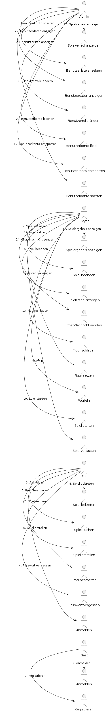

## Anwendungsfälle 

Rollen:

    Gast: Ein Benutzer, der die Anwendung nutzt, ohne eingeloggt zu sein.
    User: Ein registrierter Benutzer, der eingeloggt ist.
    Player: Ein User, der an einem Spiel teilnimmt.
    Admin: Ein Benutzer mit Administratorrechten, der das System verwaltet.

Anwendungsfälle:

    Registrieren (Gast)
    Anmelden (Gast)
    Passwort vergessen (Gast)

    Abmelden (User)
    Profil bearbeiten (User)
    Spiel erstellen (User)
    Spiel suchen (User)
    Spiel beitreten (User)

    Spiel verlassen (Player)
    Spiel starten (Player)
    Würfeln (Player)
    Figur setzen (Player)
    Figur schlagen (Player)
    Chat-Nachricht senden (Player)
    Spielstand anzeigen (Player)
    Spiel beenden (Player)
    Spielergebnis anzeigen (Player)

    Benutzerkonto sperren (Admin)
    Benutzerkonto entsperren (Admin)
    Benutzerkonto löschen (Admin)
    Benutzerrolle ändern (Admin)
    Benutzerdaten anzeigen (Admin)
    Benutzerliste anzeigen (Admin)
    Spielverlauf anzeigen (Admin)

Liste der Anwendungsfälle:  

- [AF Nutzer registrieren](06_01_AF_NutzerRegistrieren.md)
- [AF Nutzer anmelden](06_02_AF_NutzerAnmelden.md)
- ...
