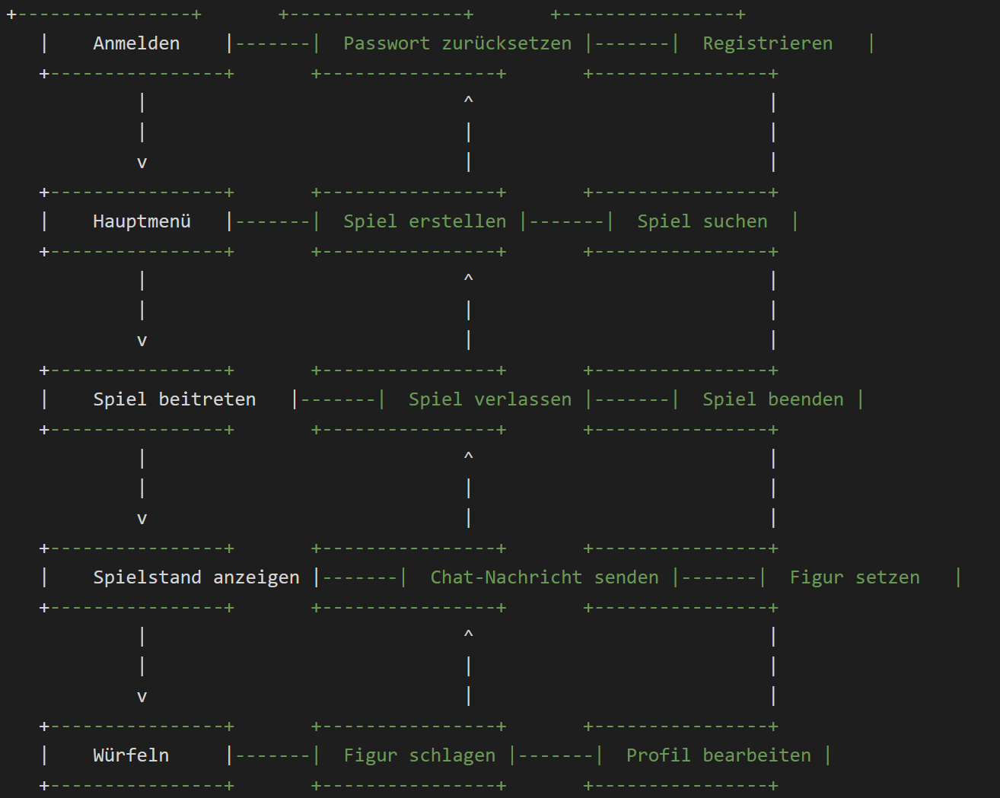

## Benutzungsschnittstelle

Textuelle Beschreibung (Bild war vorherige Ausgabe):

In dieser korrigierten Version der Benutzungsschnittstelle sind die Verbindungen zwischen den Dialogen sinnvoller. Der Benutzer kann vom Anmelde-Dialog zum Hauptmenü-Dialog navigieren, indem er sich erfolgreich anmeldet. Vom Hauptmenü-Dialog aus kann der Benutzer ein Spiel erstellen oder einem Spiel beitreten, indem er auf die entsprechenden Schaltflächen klickt. Wenn der Benutzer einem Spiel beigetreten ist, kann er den Spielstand anzeigen, Chat-Nachrichten senden, würfeln, Figuren setzen und Figuren schlagen. Der Benutzer kann auch das Spiel verlassen oder beenden, indem er auf die entsprechenden Schaltflächen klickt.

Wenn der Benutzer auf die Schaltfläche "Profil bearbeiten" klickt, wird der Dialog "Profil bearbeiten" geöffnet, in dem der Benutzer seine Benutzerdaten ändern kann. Der Benutzer kann auch sein Passwort ändern oder sein Konto löschen, indem er auf die entsprechenden Schaltflächen klickt.
